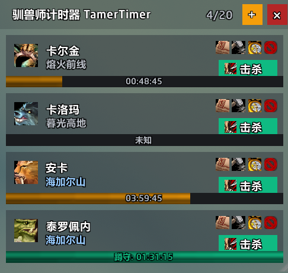
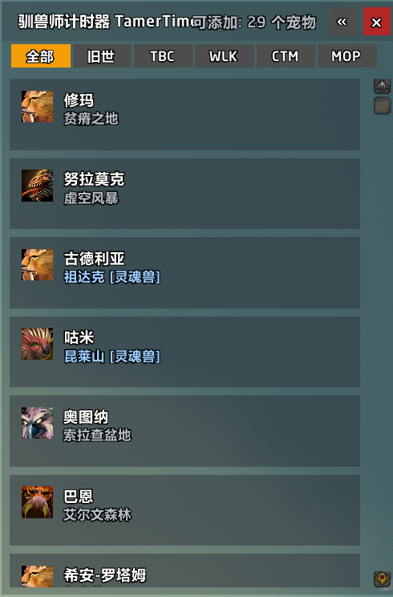
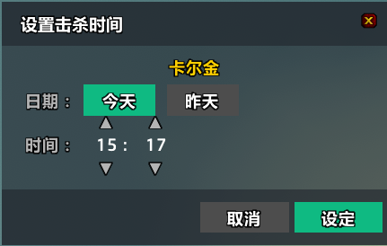
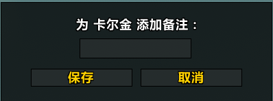

# TamerTimer - 驯兽师计时器 🐉

TamerTimer is a Rare Pet Respawn Timer for World of Warcraft (Classic).
TamerTimer 是一个用于魔兽世界（经典怀旧服）的稀有宠物刷新计时插件。

## Features / 功能特性
*   **Smart Tracking / 智能追踪**: Visualizes respawn status (Countdown / Camping). (可视化显示倒计时和蹲守状态)
*   **Minimalist UI / 极简界面**: Compact and transparent design. (紧凑透明的现代化设计)

## Screenshots / 界面截图

   
   
   

## Installation / 安装
1.  Download the latest release.
2.  Extract to `Interface/AddOns/TamerTimer`.
3.  Reload UI (`/reload`).

## Commands / 指令
*   `/tamt` - Open/Close the timer window (打开/关闭计时器)
*   Minimap Button - Click to toggle UI (点击小地图按钮切换界面)

## License
MIT

---
See [CHANGELOG.md](CHANGELOG.md) for full history.
